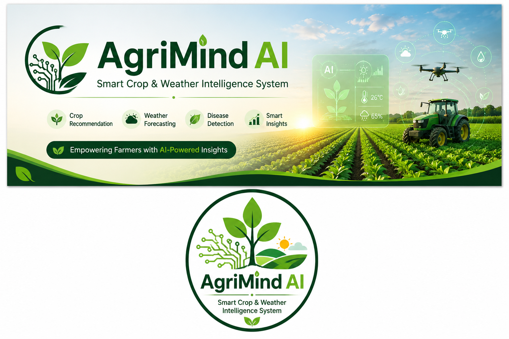

# 🌾 AgriMind AI – Smart Crop & Weather Intelligence System



<p align="center">
  <a href="https://agrimind-ai-smart-crop-weather-intelligence-system.streamlit.app/">
    
  </a>
</p>

<p align="center">
<b>Empowering Farmers with AI-Powered Crop Recommendations and Weather Intelligence</b>
</p>

---

## 🚀 Live Application

👉 **Click Here to Launch the App**

https://agrimind-ai-smart-crop-weather-intelligence-system.streamlit.app/

---

## 📖 Overview

AgriMind AI is a Machine Learning-powered smart agriculture system developed to assist farmers in selecting suitable crops based on soil nutrients and environmental conditions.

The platform analyzes agricultural data and provides intelligent crop recommendations, helping users make informed farming decisions. By integrating AI and weather intelligence, AgriMind AI aims to improve productivity and promote sustainable farming practices.

---

## 🎯 Project Objective

The primary objective of this project is to support farmers with data-driven agricultural insights and crop recommendations using Machine Learning techniques.

---

## ✨ Features

* 🌱 AI-Based Crop Recommendation
* 🌦️ Weather Intelligence Support
* 📊 Soil Nutrient Analysis
* 📈 Interactive Data Visualization
* 🤖 Machine Learning Prediction
* ⚡ Fast and User-Friendly Interface
* 🌍 Smart Farming Assistance
* 📱 Streamlit Web Application

---

## 🛠️ Technology Stack

* Python
* Streamlit
* Scikit-Learn
* Pandas
* NumPy
* Matplotlib
* Machine Learning
* Data Visualization

---

## 📥 Input Parameters

| Parameter      | Description             |
| -------------- | ----------------------- |
| Nitrogen (N)   | Soil Nitrogen Content   |
| Phosphorus (P) | Soil Phosphorus Content |
| Potassium (K)  | Soil Potassium Content  |
| Temperature    | Temperature (°C)        |
| Humidity       | Humidity (%)            |
| Rainfall       | Rainfall (mm)           |
| pH Value       | Soil pH Level           |

---

## 📤 Output

The system provides:

✅ Suitable Crop Recommendation

✅ Soil Analysis

✅ Smart Agricultural Insights

✅ Visual Graphs and Charts

✅ Better Farming Decisions

---

## 🎥 Project Demonstration


The demonstration above shows how users can enter agricultural parameters and receive intelligent crop recommendations through the AgriMind AI platform.

---

## ⚙️ Working Methodology

1. User enters soil nutrient values.
2. Environmental parameters are provided.
3. The Machine Learning model analyzes the data.
4. Crop suitability prediction is generated.
5. Results are displayed through the Streamlit dashboard.
6. Visual insights help users understand the recommendations.

---

## 🚀 Installation Guide

### Clone Repository

```bash
git clone https://github.com/Harika7075/AgriMind-AI-Smart-Crop-Weather-Intelligence-System.git
```

### Navigate to Project Folder

```bash
cd AgriMind-AI-Smart-Crop-Weather-Intelligence-System
```

### Install Dependencies

```bash
pip install -r requirements.txt
```

### Run the Application

```bash
streamlit run app.py
```

---

## 📂 Project Structure

```text
AgriMind-AI-Smart-Crop-Weather-Intelligence-System/
│
├── app.py
├── model.pkl
├── requirements.txt
├── my_banner.png
├── project_demo.gif
├── README.md
└── Additional Project Files
```

---

## 🌟 Benefits

✔️ Smart Crop Selection

✔️ Improved Agricultural Productivity

✔️ Data-Driven Farming Decisions

✔️ Easy-to-Use Interface

✔️ Sustainable Agriculture Support

✔️ AI-Powered Insights

---

## 🔮 Future Enhancements

* Fertilizer Recommendation System
* Crop Disease Detection
* Advanced Weather Forecasting
* Mobile Application Development
* Voice Assistant for Farmers
* Multi-Language Support

---

## 👩‍💻 Developed By

### Harika Podalakuru

B.Tech Student

Artificial Intelligence & Machine Learning Enthusiast

GitHub: https://github.com/Harika7075

---

## 🎯 Vision

> Leveraging Artificial Intelligence to empower farmers with smarter agricultural decisions, weather awareness, and sustainable farming solutions.

---

⭐ If you found this project useful, please consider giving it a Star on GitHub.
